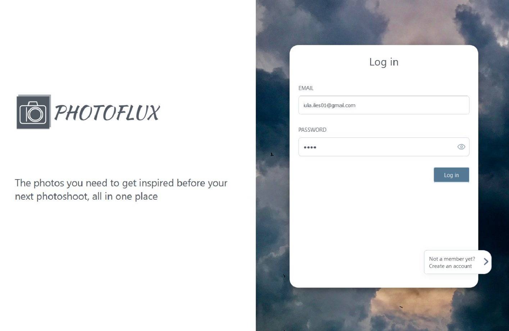
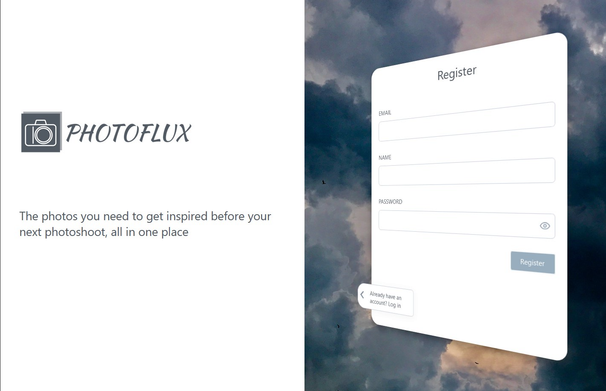
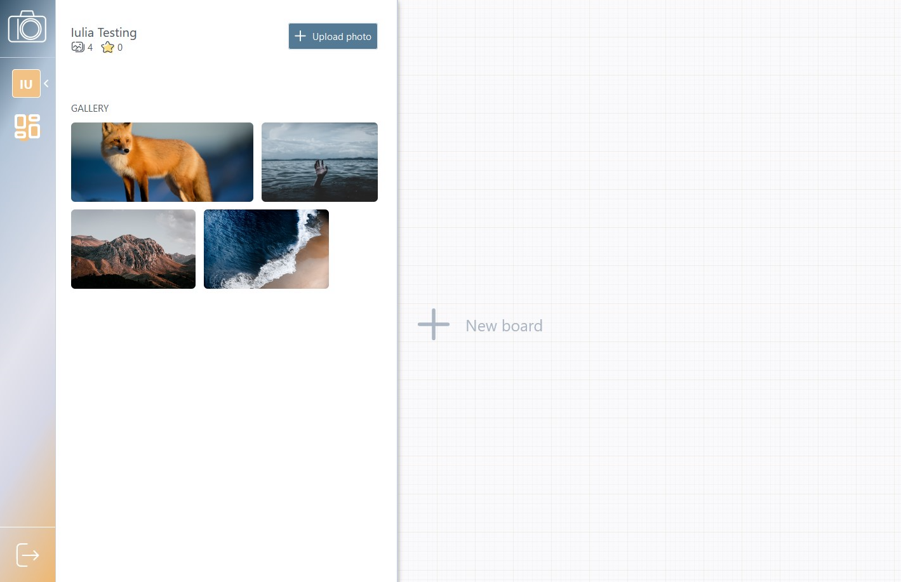
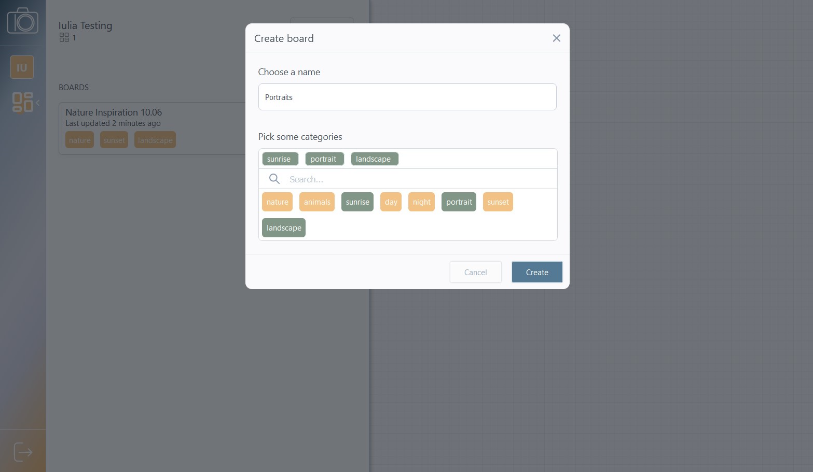
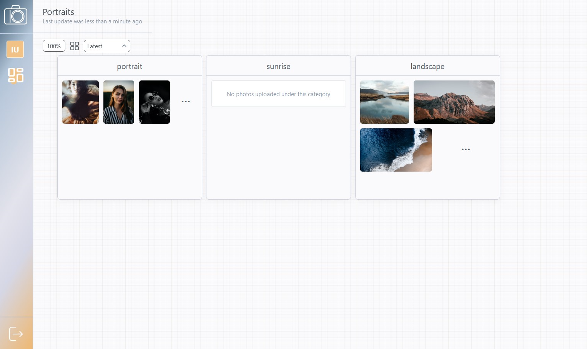
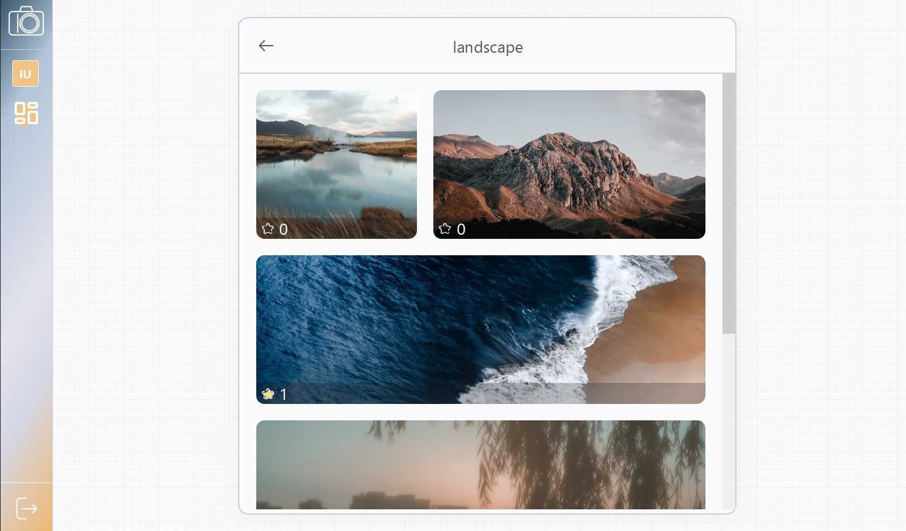

# PhotoFlux Workspace

This project acts as the frontend for PhotoFlux: a web platform designed for storing and showcasing photography. Its goal is to create a thriving environment for photo creation, a place where any photographer can come for guidance and inspiration.

The application stands out by the effort that was put into the user experience. Browsing photography is done through the means of an interactive board, allowing functionalities such as dragging, panning, and zooming. This has been achieved by utilizing [canvaSketcher](https://www.npmjs.com/package/@iuliailies/canva-sketcher): a data-visualization package focused on semantic zooming. Check out its [ReadMe](https://github.com/iuliailies/canvaSketcher) if you're interested in a thorough usage description.

## Development server

Run `ng serve` for a dev server. Navigate to `http://localhost:4200/` to see the app in action. Temporarily, the app is also deployed under [photoflux.services.ozoniuss.com](http://photoflux.services.ozoniuss.com).

## Use cases

On a high level overview, we are interested in the following user stories:

- [x] As a new user, I want to be able to create an account.
- [x] As an already registered user, I want to log in using my existing account.
- [x] As a logged in user, I want to be able to see my photo gallery.
- [x] As a logged in user, I want to be able to upload a photo, together with choosing its suitable categories.
- [x] As a logged in user, I want to create a new inspiration board by choosing my desired categories.
- [x] As a logged in user, I want to visualize a list of my previously created boards.
- [x] As a logged in user, I want to open a board and see photo clusters, based on the board categories.
- [x] As a user visualizing a board, I want to be able to interact with the photo clusters by dragging and dropping them.
- [x] As a user playing with the board layout, I want to easily reset it.
- [x] As a user visualizing a board, I want to see a cluster with "Perfect matches" for my selected categories.
- [x] As a user visualizing a board, I want to be able to zoom in and see more photos from a specific category.
- [x] As a user browsing through photos, I want to sort them based on upload time or star count.
- [x] As a user browsing through photos, I want to visualize a photo.
- [x] As a user browsing through photos, I want to star a photo.
- [x] As a user visualizing a photo, I want to download it.

We'll continue by analyzing these use cases in more detail.

### Authentication

The account creation process expects the user to provide a name, email and password. From the password perspective, I analyzed common practices and decided to prioritize the user experience over security concerns. That is, I avoided some common approaches such as the "reenter password" field, or the complexity restriction, as they can cause irritation from a user perspective.

We also took into consideration the importance of the visual aspect, as the authentication page is the first impression that any user gets of the application. I created a design that embraces color theory, while also including an intriguing animation for switching between the login and register forms.

### Profile section

Once logged into the application, the user is presented with a menu bar on the left side of the screen. The menu offers access to the profile section of the platform, from which the user photo gallery and upload photo feature are accessible. PhotoFlux stands out by accessing this feature without any form of navigation: the profile area slides into view on the left side of the screen, for quick and easy access. It is also resizable, by dragging its right edge. If needed, the profile section becomes scrollable.

Uploading a new photo is done through a pop-up modal. This process requires selecting at leats one category for the uploaded photo. This will be needed for board creation, as described a bit below.

<!-- // TODO: screenshot -->
### Boards list

The menu bar also offers access to the list of boards that were created by the current user, together with a pop-up modal for creating a new board.

### Dashboard section

The main part of the browser is allocated to the dashboard section. The board is the main idea behind PhotoFlux: an interactive canvas here photos are grouped based on their category. If no board has been selected, a button for creating one is displayed in the middle.

Once a board is selected, a cluster appears for each of its categories. In the context of PhotoFlux, cluster stands for a group of related photos. At first sight, each such cluster has only a few photos displayed. From an interactivity perspective, the board can be panned and zoomed. Panning is boundless, but zooming is constrained between the values of 50\% and 200\%. Each cluster can also be dragged independently. While this allows a pleasant user experience, it is prone to causing disorder, especially if a cluster is dragged outside the viewport. To fix this, PhotoFlux offers a button for centering the board and arranging its clusters. The button can be found in the top-left side of the screen, under the dashboard name. In the same corner there exists a dropdown field, which allows the user to select the photo sorting criteria: "latest" or "most starred".

Browsing through the photos of a cluster can be achieved by clicking it. This triggers the dashboard to get zoomed and translated such that the cluster becomes centered. At the end of the zoom behaviour, more photos get loaded, in a paginated manner. This can be seen in the photo below. At this point, all interactive features of the canvas are disabled, and the cluster is considered to be "focused".

Hovering over a photo gives the possibility of starring it, while also displaying its total number of stars. Clicking it opens the photo in a pop-up modal, from where you can star and download it.

To exit the "focused" state, the user can click the arrow button in the top-left corner, or simply press "Ctrl + Q". This reverts the animation and brings the board in the state where it was before, with all its interactivity features re-enabled.
